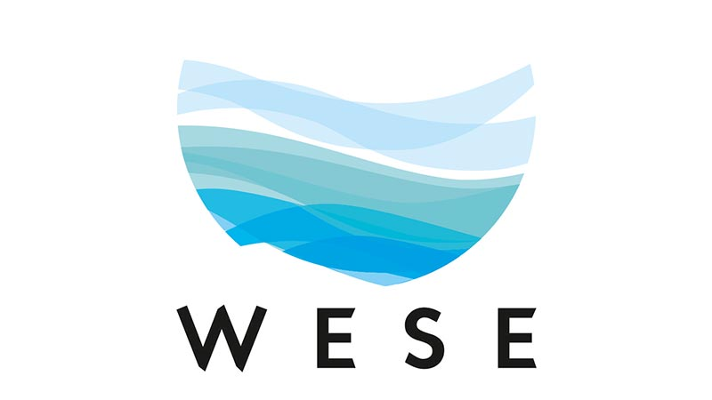

<!--
*** To avoid retyping too much info. Do a search and replace for the following:
*** github_username, repo_name, twitter_handle, email, project_title, project_description
-->

<!-- PROJECT LOGO -->
 

  

  <h3 align="center">Subsea power cable EMF modeling tool</h3>

<!-- TABLE OF CONTENTS -->

  
<h2 style="display: inline-block">Table of Contents</h2>

  <ol>
    <li>
      <a href="#about-the-project">About The Project</a>
      <ul>
        <li><a href="#built-with">Built With</a></li>
      </ul>
    </li>
    <li>
      <a href="#getting-started">Getting Started</a>
      <ul>
        <li><a href="#prerequisites">Prerequisites</a></li>
        <li><a href="#installation">Installation</a></li>
      </ul>
    </li>
    <li><a href="#usage">Usage</a></li>
    <li><a href="#roadmap">Roadmap</a></li>
    <li><a href="#contributing">Contributing</a></li>
    <li><a href="#license">License</a></li>
    <li><a href="#contact">Contact</a></li>
    <li><a href="#acknowledgements">Acknowledgements</a></li>
  </ol>

<!-- ABOUT THE PROJECT -->
## About The Project
This code was developed within the scope of WESE project, funded by the European Commission, which aims to increase the knowledge over the potential environmental effects of ocean energy projects. This specific piece of code, is part of the EMF modelling task, and aims to estimate the estimate the EMF radiated from operating subsea pwer cables used in offshore renewable energy projects.

It leverages significantly from the [Finite Element Method Magnetics (FEMM)](https://www.femm.info/) software package, a simple, low computational cost software package for solving electromagnetic projects using finite element method. Using it's python API, this code develop to generating specific submarine cable designs, by adjusting relevant cable component dimensions, electromagnetic properties and electrical characteristics. 

<!-- GETTING STARTED -->

### Prerequisites

You'll need to have latest version of the [Finite Element Method Magnetics (FEMM)](https://www.femm.info/) installed in your computer, as well as the Numpy, Scipy, pyFEMM and matplotlib python libraries.

<!-- USAGE EXAMPLES -->
## Usage

The code definetly lacks structure, but it's functional and should work straighforwardly. The following inputs can be found

Subsea Cable Dimensions: 
•	Conductor cross sectional area (mm2)
•	Conductor screen thickness (mm)
•	Conductor insulation thickness (mm)
•	Conductor insulation nonmetallic screen thickness 
•	Conductor insulation metallic screen thickness (mm)
•	Bedding thickness (mm)
•	Armour radius (mm)
•	2nd Armour layer radius (mm) -> set 0 if non-existent
•	Over Sheath thickness (mm)
•	Burial depth [mm] -> set 0 if surface laid

Electromagnetic properties	Definition of the conductivity (S/m) and relative permeability (unitless) of all objects:
•	Conductors
•	Insulation
•	Nonmetallic Insulation Screen
•	Metallic Insulation screen
•	Inner Sheath	•	Bedding
•	Armour
•	Over sheath
•	Seawater
•	Seabed

Electrical Characteristics	•	RMS Phase Current (A)
•	Grid frequency (Hz)

<!-- CONTRIBUTING -->
## Contributing

Contributions are what make the open source community such an amazing place to learn, inspire, and create. Any contributions you make are **greatly appreciated**.

1. Fork the Project
2. Create your Feature Branch (`git checkout -b feature/AmazingFeature`)
3. Commit your Changes (`git commit -m 'Add some AmazingFeature'`)
4. Push to the Branch (`git push origin feature/AmazingFeature`)
5. Open a Pull Request

<!-- LICENSE -->
## License

Distributed under the MIT License. See `LICENSE` for more information.

<!-- CONTACT -->
## Contact

Paulo Chainho - [Linkedin](www.linkedin.com/in/paulo-chainho) - paulo@wavec.org

Project Link: [https://github.com/WavEC-Offshore-Renewables/EMF_modeling_tool](https://github.com/WavEC-Offshore-Renewables/EMF_modeling_tool)

<!-- ACKNOWLEDGEMENTS -->
## Acknowledgements

* 
* 
* 

